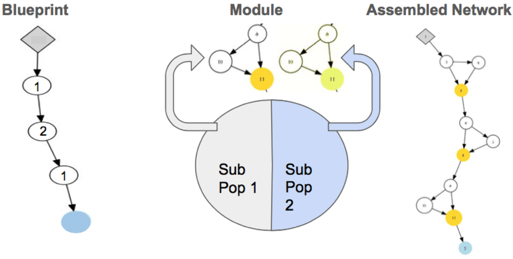

# Evolving-Architecture
Based upon: https://arxiv.org/abs/1703.00548

REPO for CoDeepNeat class: https://github.com/sbcblab/Keras-CoDeepNEAT 

# Keras-CoDeepNEAT
[CoDeepNEAT](https://arxiv.org/abs/1703.00548) inspired implementation using Keras and Tensorflow as backend.

Experiment discussion and description: [arXiv:2002.04634](https://arxiv.org/abs/2002.04634)

## General instructions

Download the repository and import the ``base/kerascodeepneat.py`` file into your Python Script.
This will give you access to the Population and Dataset classes, which are the only necessary classes to run the entire process.

## Outputs

The framework generates a series of files logging the evolution of populations (into .log, .csv and .json files), including informations related to:
- Model assembling, evaluation, speciation, reproduction and generation summary details (test.log)
- Scores, features and species for individuals over generations (iterations.csv)
- Training history for final model (training.csv and training.json)
- Images representing modules, blueprints, assembled graphs, keras models for every individual (\images directory in .png format)
- Keras models related to the best models for every generation (\models directory in .h5 format).

## Requirements
- Keras 2.2.5
- Tensorflow 1.13.1.
- Networkx 2.3.
- PyDot 1.4.1
- GraphViz 0.11.1
- SkLearn 0.21.3

-sudo apt-get install python3-dev graphviz libgraphviz-dev pkg-config

-sudo pip install pygraphviz

Compartibility with other version has not been tested.                                                                                                                                                                                                                                                                                                                                                                                                                                                          

               
